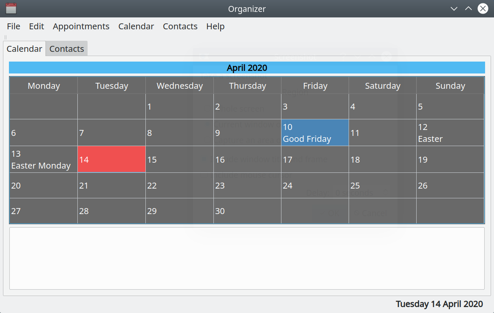

# LXQt Organizer

## Overview

LXQt Organizer is a Qt lightweight personal information manager.

It is maintained by the LXQt project but can be used independently from this
desktop environment.



### Compiling source code

Compiling from source provides the latest version.  

```
cmake -B build -S .
cmake --build build
cmake --install build
```

### Dependencies

Runtime dependencies are [liblxqt](https://github.com/lxqt/liblxqt), qtmultimedia and qtsvg.
Additional build dependencies are CMake, [lxqt-build-tools](https://github.com/lxqt/lxqt-build-tools), qt6-tools and optionally Git to pull latest VCS checkouts.

## Versioning

[SemVer](http://semver.org/) is used for versioning. The version number has the form 0.0.0 representing major, minor and bug fix changes. Currently at 0.7.4.

## Roadmap

- [ ] Vdir storage
  - [ ] Vdir calendar storage
  - [ ] Vdir address book storage
  - [ ] iCalendar .ics parsing/serialization
  - [ ] Atomic writes, etags, and locking
  - [ ] Read-only calendars
  - [ ] Unavailable collections
  - [ ] Move between calendars
- [ ] Multiple collections
  - [ ] Multiple calendars visible at once
  - [ ] Multiple address books
  - [ ] Side panel
  - [ ] Accounts dialog
  - [ ] Discovery
  - [ ] Default calendar and address book selection
  - [ ] Metadata editing
  - [ ] Rename
  - [ ] Per-calendar color
  - [ ] Per-calendar visibility
  - [ ] Per-calendar ignore alarms
  - [ ] Automatic refresh (QFileSystemWatcher)
  - [ ] Manual refresh
- [ ] User interface
  - [ ] Toolbar
  - [ ] Menu
  - [ ] Status line
  - [ ] Multiple main windows
  - [ ] Search forward/backward
  - [ ] Month/week/year alternate views
  - [ ] Cut/copy/paste items
  - [ ] Keyboard shortcuts
  - [ ] Holidays
  - [ ] User guide
  - [ ] About
- [ ] CLI
  - [ ] Text listings
  - [ ] Popup listings
  - [ ] Print listings
  - [ ] New window from CLI
  - [ ] Start minimized to tray
- [ ] Appointments
  - [ ] Day appointment window
  - [ ] Scrolling
  - [ ] Create/edit/delete items
  - [ ] Inline editing
  - [ ] Create by clicking day area
  - [ ] Drag move
  - [ ] Drag resize
  - [ ] Item title/description
  - [ ] Start time / end time / duration
  - [ ] All-day appointments
  - [ ] Multi-day appointments
  - [ ] Time zones
  - [ ] Location
  - [ ] Notes/long description
  - [ ] URL
  - [ ] Attachment
  - [ ] Priorities and highlight colors
- [ ] Recurrence
  - [ ] Don't repeat
  - [ ] Daily
  - [ ] Weekly
  - [ ] Monthly
  - [ ] Annually/yearly
  - [ ] Custom interval
  - [ ] Weekly multiple weekdays
  - [ ] Monthly nth day
  - [ ] Monthly nth-last day
  - [ ] Monthly nth working day
  - [ ] Monthly nth-last working day
  - [ ] Monthly nth weekday
  - [ ] Monthly last/nth-last weekday
  - [ ] Start/finish recurrence range
  - [ ] Last occurrence command
  - [ ] Make unique/edit single occurrence
  - [ ] Delete one occurrence
  - [ ] This-and-future recurrence changes
  - [ ] Cut repeating item: occurrence vs series
  - [ ] Paste loses recurrence
  - [ ] Advanced yearly BYMONTH/BYMONTHDAY/BYYEARDAY/BYWEEKNO/BYSETPOS
- [ ] Tasks
  - [ ] Create/edit/delete tasks
  - [ ] Mark task done/not done
  - [ ] Task checkbox in list
  - [ ] Task due date/time
  - [ ] Task recurrence
  - [ ] Option for task to automatically move forward
  - [ ] Done task stops moving forward
  - [ ] Task priority
  - [ ] Early warnings
  - [ ] Default listing/early warning
  - [ ] Highlight always
  - [ ] Never highlight
  - [ ] Highlight future only
  - [ ] Holiday highlight
  - [ ] Month selector date indicators
  - [ ] Search
- [ ] Contacts
  - [ ] Create/edit/delete contacts
  - [ ] Birthdays
  - [ ] Email action
  - [ ] Quick and full contact views
- [ ] Reminders and alerts
  - [ ] Appointment alarms
  - [ ] Multiple alarms per appointment
  - [ ] Default alarms
  - [ ] Reminder popup
  - [ ] Reminder sound/beep
  - [ ] Repeated alarm until start
  - [ ] Snooze
  - [ ] Ignore alarms by calendar
  - [ ] System tray
- [ ] Import and export
  - [ ] Import appointments
  - [ ] Export appointments
  - [ ] Import contacts
  - [ ] Export contacts
- [ ] Listings, reports, and printing
  - [ ] Upcoming schedule report
  - [ ] Upcoming birthdays report
  - [ ] List one day
  - [ ] List seven days
  - [ ] List ten days
  - [ ] List thirty days
  - [ ] List current week
  - [ ] List current month
  - [ ] List current year
  - [ ] List from selected calendar
  - [ ] Early-warning inclusion in listings
  - [ ] Print calendar contents
  - [ ] Print preview
  - [ ] Print
  - [ ] PDF output
  - [ ] A4 paper support
- [ ] Preferences and customization
  - [ ] Appointment/day view range
  - [ ] Display AM/PM preference
  - [ ] Start week on Monday preference
  - [ ] Default alarms preference
  - [ ] Default listings/early warning preference
  - [ ] Calendar font size preference
  - [ ] Light/dark theme support
  - [ ] Configurable command keys

### Translation (Weblate)

Translations can be done in [LXQt-Weblate](https://translate.lxqt-project.org/projects/lxqt-desktop/lxqt-organizer/).
